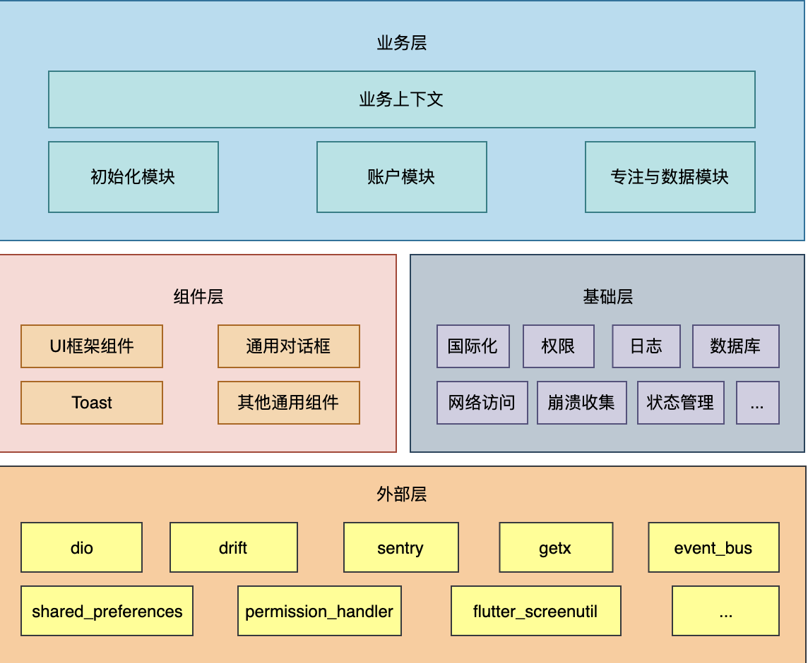
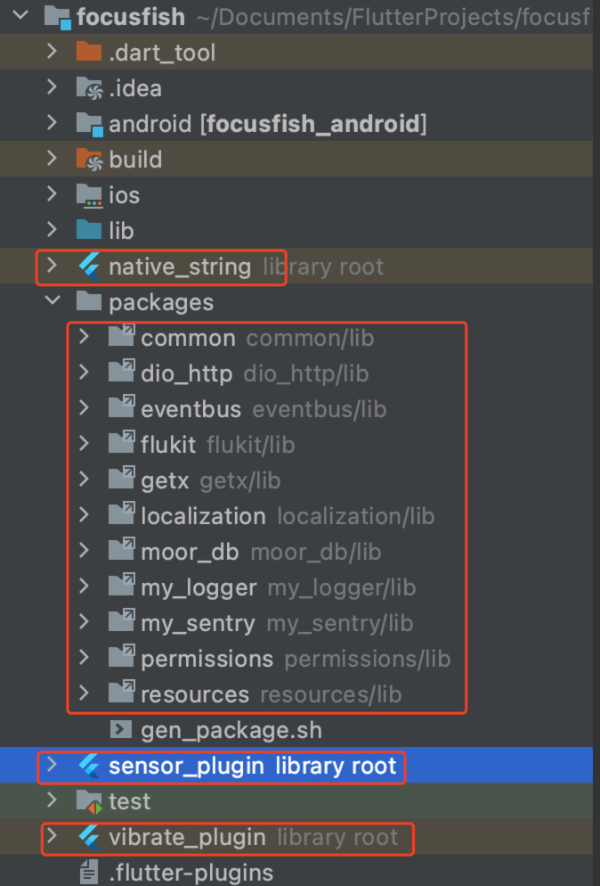
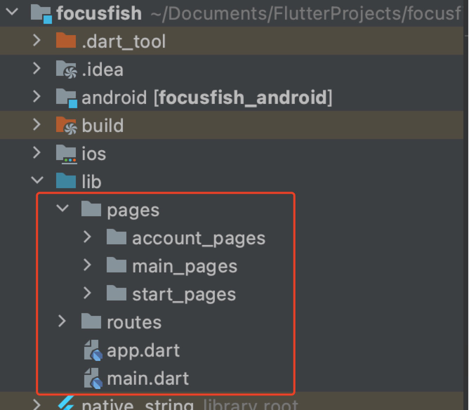
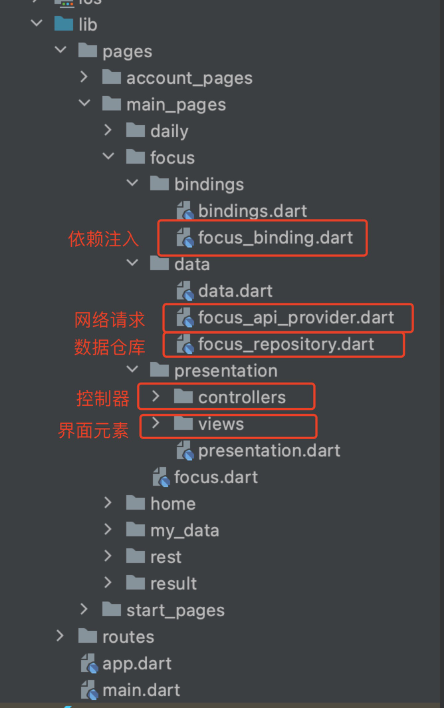

# 专注鱼APP架构文档

> 	该架构文档的业务层是基于第一版的原型划分的模块，不排除之后迭代版本会对已有模块的增加与修改，其他层级理论上不会再变化。

## 一. 框架设计

### 1. 框架设计图

	
### 2. 框架整体说明

整个框架基于[flutter](https://flutter.dev/)开发，划分成业务层、组件层、基础层与外部层。其中外部层对应着第三方依赖库，基础层主要对应着非UI的基础性功能，组件层对应着UI功能的基础性功能，可以向业务层提供完整可以使用的UI组件功能。业务层则是应用的核心，除了外部层之外，组件层、基础层以库的形式提供给业务层使用，这样的好处是提高了这两层的复用性。

### 3. 框架设计原则

- 层级职责划分需要单一且清晰。
- 业务与非业务相关需要明显划分，这样可以使开发更集中于业务上，非业务功能可以尽可能的被复用，一举两得。
- 在不破坏平台设计理念的前提下，框架要易于快速开发，减少重复代码。

## 二. 各层级详细说明

### 1. 外部层

外部层主要引用了多个第三方库，优质的三方库可以为快速开发打下坚实的基础。

- [dio](https://github.com/flutterchina/dio)

    dio是一个强大的Dart Http请求库，支持Restful API、FormData、拦截器、请求取消、Cookie管理、文件上传/下载、超时、自定义适配器等。
    
- [drift](https://drift.simonbinder.eu/docs/getting-started/)

    drift 是一个用于 Dart&Flutter 应用的响应式持久化数据库。它是建立在像 sqlite 或 sql.js 类似的数据库的库之上，并提供一些特性，如：类型安全、流查询、流畅的查询、类型安全 SQL、迁移工具等。
    
- [sentry](https://docs.sentry.io/platforms/flutter/)

    sentry 是 flutter 官方推荐的错误崩溃收集工具。用户可以通过sentry官网注册账号直接使用其服务，但是由于墙的原因，大陆用户无法访问，所以sentry也提供了[私有化部署的方案](https://github.com/getsentry/self-hosted)。
    
- [getx](https://github.com/jonataslaw/getx)

    getx 是 flutter 上的一个轻量且强大的解决方案：高性能的状态管理、智能的依赖注入和便捷的路由管理。同时，getx是本框架业务层开发的核心基础。
    
- [event_bus](https://github.com/marcojakob/dart-event-bus)

    event_bus是一个使用 Dart Streams 解耦应用程序的简单事件总线。事件总线遵循发布/订阅模式，它允许订阅者订阅事件并允许发布者触发事件，这使对象无需显式定义监听器并跟踪它们即可进行交互。
    
- [shared_preferences](https://github.com/flutter/plugins/tree/main/packages/shared_preferences/shared_preferences)

    shared_preferences是为平台的简单数据做持久化存储的插件。
    
- [permission_handler](https://github.com/baseflow/flutter-permission-handler)

    permission_handler是为平台做权限申请（如读取权限、相机权限等）的插件。
    
- [flutter_screenutil](https://github.com/OpenFlutter/flutter_screenutil)

    flutter_screenutil 是一套屏幕适配方案，让你的UI在不同尺寸的屏幕上都能显示合理的布局。
    
- 其他三方库，请自行搜索查阅相关文档，这里不一一做介绍。

### 2. 基础层

基础层是在外部层的基础上针对本项目做了进一步的封装，方便业务层的直接调用，但是基础层与业务层是高度解偶的，数据不产生直接关联。基础层的自定义包位于项目的packages文件夹下，相关自定义插件位于主目录focusfish下。

- 国际化 -- packages/localization

    为项目提供多语言支持，目前项目已添加中文简体、中文繁体、英文和日文的配置。需要注意的是，app的名字国际化需要在android和ios的原生工程里定义。
    
- 权限 -- packages/permissions

    对平台做相应的权限申请与管理，当然，所需权限也要在原生工程做申请。
    
- 日志 -- packages/my_logger

    相关日志的打印，方便debug与排查问题。
    
- 数据库 -- packages/moor_db

    基于 drift 的数据库管理，主要用于用户数据的存储与获取。
    
- 网络访问 -- packages/dio_http

    基于 dio 的http访问封装，同时添加公共响应解析和错误重试机制。
    
- 崩溃收集 -- packages/my_sentry

    sentry的一些基础配置。
    
- 状态管理 -- packages/getx

    getx的一些基础配置。
    
- 资源与基础样式 -- packages/resources

    主题样式、暗黑模式、图片资源、颜色、屏幕适配等配置。
    
- 明文加密 -- native_string

    项目经常会用到一些appkey、通信的密钥、服务器的url等明文不希望被简单的逆向破解，可将其放在native_string中加密，增加破解难度。
    
- 传感器插件 -- sensor_plugin

    传感器插件通过不同设备的传感器返回手机的姿态，该项目用来判断手机是否抬起。
    
- 震动插件 -- vibrate_plugin

    震动插件可以通过振动手机提供不同的反馈，增加用户体验。
    
### 3. 组件层

组件层提供了基础的UI框架组件，对话框、Toast、ListView等常用UI组件与元素，也包括一些自己封装的组件。
    
- 复杂组件 -- packages/flukit

    对网上下载的第三方组件库进行自定义修改后，将其放在这里。
    
- 自定义组件 -- packages/common/widget

    自定义组件等通用代码。
    
### 4. 业务层

业务层通过使用getx框架将业务层设计成了三部分，依次是：依赖注入、网络请求与数据仓库、控制器与界面元素。细分的好处是各部分职责清晰，开发过程思路明确，后期维护、扩展简单。不好的地方是细分后，层级变深，多出了部分冗余代码，相对来说会增加开发成本。

- 路由管理 -- lib/routes

    页面之间的跳转路由均在这里定义，方便统一管理。

- 初始化模块 -- lib/pages/start_pages

    该模块主要定义app初始时的页面，包括闪屏页面、引导页面、数据加载页面等。
    
- 账户模块 -- lib/pages/account_pages

    该模块主要定义账户相关的页面，包括登录页面、注册页面、修改密码页面等。
    
- 专注与数据模块 -- lib/pages/main_pages

    该模块处理主要的业务逻辑，包括主页面、专注页面、专注数据显示页面等。

    

    

